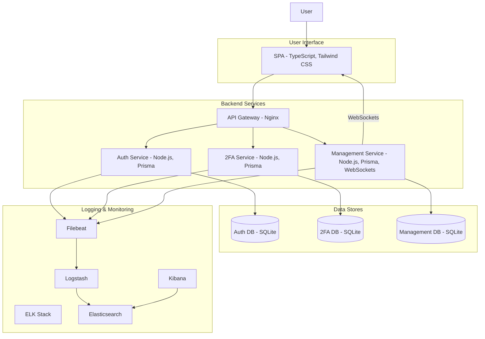
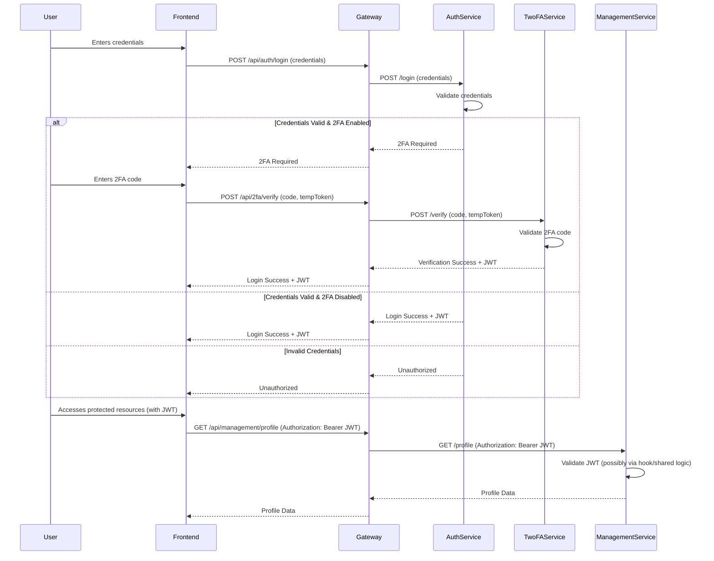
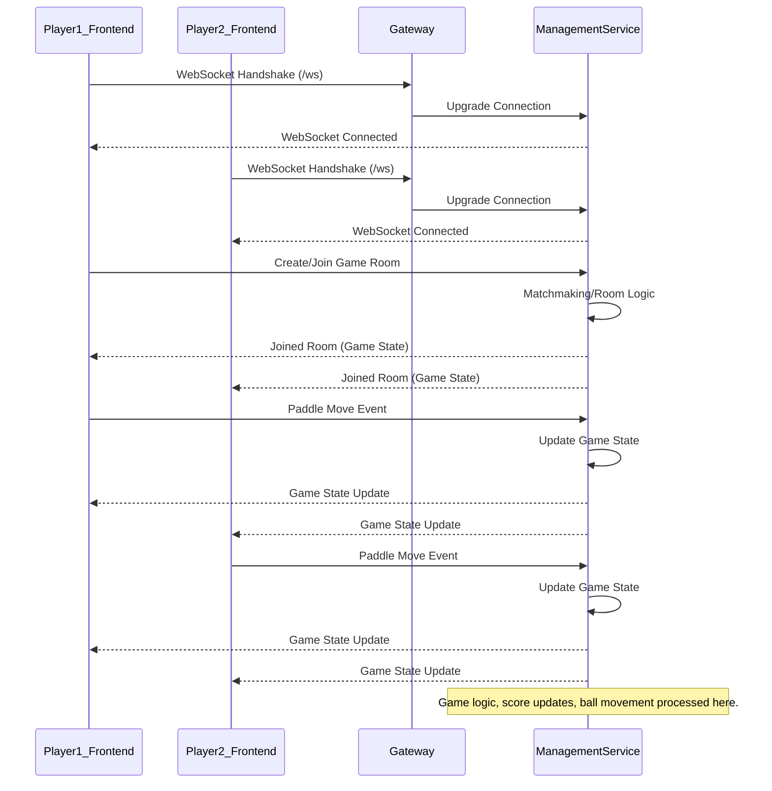

# FT_Transcendence - Multiplayer Pong Game (Building the backend part Only)

## 🚀 Overview

FT_Transcendence is a modern, web-based multiplayer Pong game application. It serves as a comprehensive project to explore and implement various web development concepts, including microservices architecture, real-time communication, user authentication, and single-page application (SPA) design. Users can create accounts, challenge each other to Pong matches, manage their profiles, and interact with friends.

## ✨ Features

*   **Real-time Multiplayer Pong:** Engage in exciting Pong matches with other players.
*   **User Authentication:** Secure user registration and login system.
    *   **OAuth 2.0:** Support for Google authentication.
    *   **Two-Factor Authentication (2FA):** Enhanced account security.
*   **User Profiles:** Customizable user profiles with avatars and statistics.
*   **Friend System:** Add and manage friends within the application.
*   **Match History:** Keep track of past matches and results.
*   **Single Page Application (SPA):** Seamless user experience with browser navigation (Back/Forward buttons).
*   **Centralized Logging:** Robust logging and monitoring using the ELK stack.

## 📚 Learning Objectives

This project aims to provide hands-on experience with:

*   **Microservices Architecture:** Designing, building, and deploying a system composed of independent, scalable services.
*   **Full-Stack Development:** Working with both frontend (TypeScript, Tailwind CSS) and backend (Node.js, Fastify, Prisma) technologies.
*   **Single Page Application (SPA) Development:** Creating a responsive and dynamic user interface.
*   **Real-Time Communication:** Implementing real-time features like multiplayer gaming and potentially chat using WebSockets.
*   **Authentication & Authorization:** Implementing secure authentication mechanisms, including JWT, OAuth 2.0, and 2FA.
*   **Database Management:** Using Prisma ORM for database interactions with SQLite.
*   **Containerization:** Utilizing Docker and Docker Compose for consistent development and deployment environments.
*   **API Gateway:** Managing and routing API requests using Nginx.
*   **Centralized Logging & Monitoring:** Implementing a logging solution with Elasticsearch, Logstash, and Kibana (ELK Stack).
*   **DevOps Practices:** Gaining insights into building, deploying, and managing a complex web application.

## 🏗️ Architecture

FT_Transcendence employs a microservices architecture to ensure scalability, maintainability, and separation of concerns. The system is composed of several key services that interact with each other through an API Gateway.



### Service Breakdown:

1.  **Frontend (`frontend/`)**
    *   **Technology:** TypeScript, Tailwind CSS
    *   **Description:** A Single Page Application (SPA) that provides the user interface for the Pong game, user accounts, social features, and interactions. It communicates with the backend services via the API Gateway.

2.  **API Gateway (`gateway/`)**
    *   **Technology:** Nginx
    *   **Description:** Acts as a reverse proxy and the single entry point for all client requests. It routes requests to the appropriate backend microservices, handles SSL termination (if configured), and can manage concerns like rate limiting and load balancing.

3.  **Authentication Service (`auth-service/`)**
    *   **Technology:** Node.js (likely Fastify), Prisma, TypeScript
    *   **Database:** SQLite (`auth.db`)
    *   **Description:** Manages all aspects of user authentication, including:
        *   User registration and login.
        *   Password hashing and verification.
        *   JWT (JSON Web Token) generation and validation.
        *   OAuth 2.0 integration (e.g., Google Sign-In).

4.  **Two-Factor Authentication Service (`twofa-service/`)**
    *   **Technology:** Node.js (likely Fastify), Prisma, TypeScript
    *   **Database:** SQLite
    *   **Description:** Handles the logic for two-factor authentication, providing an extra layer of security for user accounts. It likely integrates with the Auth Service.

5.  **Management Service (`management-service/`)**
    *   **Technology:** Node.js (likely Fastify), Prisma, TypeScript, WebSockets
    *   **Database:** SQLite (`management.db`)
    *   **Description:** Responsible for core application logic beyond authentication, including:
        *   User profile management (avatars, display names, stats).
        *   Friendship management (adding, removing, listing friends).
        *   Match history tracking.
        *   Real-time communication for the Pong game and potentially chat features via WebSockets.

6.  **Databases (`prisma/data/` in each service)**
    *   **Technology:** SQLite (managed by Prisma)
    *   **Description:** Each microservice that requires data persistence has its own dedicated SQLite database. This adheres to the database-per-service pattern in microservices, ensuring loose coupling. Prisma is used as the ORM for database interactions and migrations.

7.  **ELK Stack (`elk-stack/`) & Filebeat**
    *   **Technology:** Elasticsearch, Logstash, Kibana, Filebeat
    *   **Description:** Provides a centralized logging and monitoring solution.
        *   **Filebeat:** Deployed alongside services (or configured to access their logs) to collect log data.
        *   **Logstash:** Processes and transforms incoming logs from Filebeat.
        *   **Elasticsearch:** Stores and indexes the processed logs for efficient searching and analysis.
        *   **Kibana:** A web interface for visualizing and querying logs stored in Elasticsearch.

### Key Architectural Flows:

#### 1. User Authentication Flow



#### 2. Real-time Game Flow (Simplified)



## 💻 Technology Stack

*   **Frontend:**
    *   TypeScript
    *   Tailwind CSS
    *   (A JavaScript framework/library might be used, e.g., React, Vue, or Svelte, as per "Minor module" allowance)
*   **Backend:**
    *   Node.js
    *   Fastify (inferred, a common choice for this structure with hooks, controllers, services)
    *   TypeScript
    *   Prisma ORM
*   **Databases:**
    *   SQLite
*   **API Gateway:**
    *   Nginx
*   **Containerization:**
    *   Docker
    *   Docker Compose
*   **Logging & Monitoring:**
    *   ELK Stack (Elasticsearch, Logstash, Kibana)
    *   Filebeat
*   **Authentication:**
    *   JWT (JSON Web Tokens)
    *   OAuth 2.0 (Google)
    *   Two-Factor Authentication (2FA)
*   **Communication:**
    *   REST APIs
    *   WebSockets

## ⚙️ Setup and Installation

### Prerequisites

*   Docker: [Install Docker](https://docs.docker.com/get-docker/)
*   Docker Compose: (Usually comes with Docker Desktop) [Install Docker Compose](https://docs.docker.com/compose/install/)
*   A web browser (e.g., Chrome, Firefox)

### Running the Project

1.  **Clone the repository (if you haven't already):**
    ```bash
    git clone https://github.com/LAHMAMI1/FT_Transcendence_V16.0.git
    cd FT_Transcendence
    ```

2.  **Environment Variables:**
    Each service (`auth-service`, `management-service`, `twofa-service`) might require a `.env` file for configuration (e.g., database URLs, JWT secrets, OAuth credentials). Check each service's directory for a `.env.example` or similar file and create your own `.env` files accordingly.

    *   `auth-service/.env`
    *   `management-service/.env`
    *   `twofa-service/.env`

    Key variables might include:
    *   `DATABASE_URL` (e.g., `file:./data/auth.db`)
    *   `JWT_SECRET`
    *   `GOOGLE_CLIENT_ID`
    *   `GOOGLE_CLIENT_SECRET`
    *   `FRONTEND_URL`

3.  **Build and run the application using Docker Compose:**
    This command will build the images for each service (if not already built) and start all the containers defined in `docker-compose.yml` and `docker-compose-elk.yml`.

    ```bash
    docker-compose -f docker-compose.yml -f docker-compose-elk.yml up --build -d
    ```
    *   `--build`: Forces Docker to rebuild the images.
    *   `-d`: Runs the containers in detached mode (in the background).

4.  **Accessing the Application:**
    *   **Frontend Application:** Open your web browser and navigate to `http://localhost:<FRONTEND_PORT>` (The frontend port depends on your Nginx configuration, typically 80 or a custom port like 3000 or 8080. Check `gateway/nginx.conf` and `docker-compose.yml`).
    *   **Kibana (for logs):** Navigate to `http://localhost:5601`.

5.  **Database Migrations (Prisma):**
    Prisma migrations are likely handled within the Docker entrypoint scripts or need to be run manually if not automated. If you encounter database issues or after pulling changes that include schema modifications:

    For each service using Prisma (`auth-service`, `management-service`, `twofa-service`):
    ```bash
    # Example for auth-service
    docker-compose exec auth-service npx prisma migrate deploy
    # or if you need to generate a new migration from schema changes (development)
    # docker-compose exec auth-service npx prisma migrate dev --name your_migration_name
    ```
    Repeat for `management-service` and `twofa-service` by changing `auth-service` to the respective service name.

6.  **Stopping the Application:**
    ```bash
    docker-compose -f docker-compose.yml -f docker-compose-elk.yml down
    ```
    To remove volumes (and thus data):
    ```bash
    docker-compose -f docker-compose.yml -f docker-compose-elk.yml down -v
    ```
